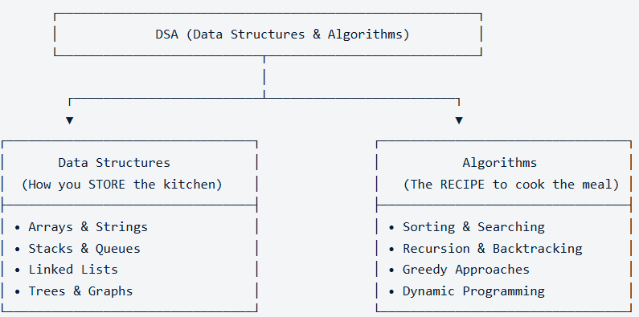

# Warm Up

Solving DSA questions requires 2 steps
1. Understand and come up with approach - Solution
2. Code



### 01. **Programming 101**

*We write some piece of code and it produces some output, that's all basically programming.*

👉 01. First Program we ever write in any programming language

```jsx
console.log("Hello World");
```

👉 2. Data Types: Strings, Numbers, Boolean, Arrays, Objects etc,.

```jsx
Strings - anything wrapped inside the double quotes; "string"
Number  - 2, 1222,
Boolean - true, false
```

👉 3. Variables - let, const, : to store something into variables

```jsx
let name = "praveen";
const YearOfBirth=2000
```

👉 4. Mathematical operations: +, -, * etc,.

```jsx
const a = 10;
const b = 20;

const sum = a + b;
const multiply = a * b;
const difference = a - b;

console.log(difference);

let firstName = "Praveen";
let lastName = "T";

firstName = "Pravin";
let fullName = firstName + " " + lastName; // Concatenation

console.log(fullName)
```

👉  5. Arrays stores multiple values | index starts from 0 | Stores any data type

```jsx
let arr = [1, 32, 43, 23, 24, 98];
let arr1 = [98, "hello", true, "", -3, [1, 2], ];
let arr2 = ["praveen", [1, 2, [2,4]]]
let sum1 = arr[0] + arr[4];
console.log(sum1);

// Access using indexes.
console.log(arr[6]); // undefined | if element not exists
console.log(arr1[5]); // [1, 2]
console.log(arr1[5][0]); // 1
console.log(arr2[1][2][1]); // 4	

/**
 * Arrays : [5, 10, 2, 0, 1]
 * 
 * index    value 
 *  0        5
 *  1        10
 *  2        2
 *  3        0
 *  4        1
 * 
 * arr[1]
 */
```

👉 6. Objects - Created by curly braces | key-value pairs

```jsx
let obj = {
    a: 7,
    firstName: "Praveen",
    lastName: "T",
    bool: true,
    arr: [6,7,8]
}

// Access using keys.
console.log(obj.firstName + obj.lastName)
console.log(obj.arr)

/**
 * Objects: {a:1, name: "praveen", bool: true, arr: [1, 2,3]}
 * 
 * key      value 
 *  a        1   
 *  name     praveen 
 *  bool     true    
 *  arr      [1, 23]
 * 
 * obj.name 
 */
```

### **02. Functions & if-else**

**👉 1. Basic Program**

```jsx
function printHelloWorld(){
    console.log('Hello world!')
}

printHelloWorld(); // until it is called, the function printHelloWorld can't be executed.
```

**👉 2. Reusable functions**

```jsx
function greet(name){
    console.log(`Hello, ` + name)
}

greet('Praveen') // Hello, Praveen
greet('Naveen') // Hello, Naveen

function sum(a, b){
    let add = a + b;
    console.log(add);
}

let x = 10;
let y = 30;
let z = 20;
// sum(10, 20);
sum(x, y);
sum(z, x);
```

**👉 3. Returning a value, instead of printing inside the function.**

```jsx
function square(x){
    let result = x * x;
    return result;
}

square(2);

let value = square(4);
console.log(value); // 16 (4 * 4 = 16)

let value1 = square(-3);
console.log(value1); // 9 (- 3 * -3 = 9)
```

The function square is called, and the let result = x * x is executed, it created the result, and
the result is returned, when it returns the result, i need to collect the returned value inside the
variable `value`. SO basically whatever the function square return, that will come on here in `value`. So if i say square(2), 2 goes inside x, 2 * 2 the result will become 4, this 4 will be returned, and whatever square(2) will return will go inside the `value`.

👉 **4. if-else statement**

**Question 1**: Create a function which accepts the age and tells whether a person is eligible to vote or not. 

```jsx
function eligibleToVote(age){
    if(age < 0){
        console.log('Invalid Input');
    }else if(age < 18){
        console.log('Not eligible to vote')
    }
    else{
        console.log('Eligible to vote')
    }
}

eligibleToVote(18); // Eligible to vote
eligibleToVote(15); // Not eligible to vote
eligibleToVote(-1); // Invalid Input

/* Among multiple statements, only one statement will be executed, 
 if any one of the statement is true, then it will stops there and print.
*/
```

**Question 2**: Create a function to check if a number is even or odd.

```jsx
function isEvenOdd(num){
    let rem = num % 2;
    if(rem == 0){
        console.log("Even Number")
    }else{
        console.log("Odd Number")
    }
}

isEvenOdd(6); // Even Number
isEvenOdd(7); // Odd Number
isEvenOdd(7749563485); // Odd Number
```

### 03. **Loops 01**

👉 Whenever you do a reparative task you need a loop, loop means doing things over and over again.

```jsx
// Example: Print hello world 10 times and what if need to print 100 times or more than that? 

// console.log('Hello world !');
// console.log('Hello world !');
// console.log('Hello world !');
// console.log('Hello world !');
// console.log('Hello world !');
// console.log('Hello world !');
// console.log('Hello world !');
// console.log('Hello world !');
// console.log('Hello world !');

 for(let i = 0; i < 20; i++){
     console.log('Hello world !');
 }
```

Whatever you write inside the curly braces {}. will be executed every time this loop runs. loop is like a cycle. for every cycle, whatever you write inside the {} braces will executed number of times. above code will print Hello world for 20 times.

**Example: 2**

```jsx
 for(let i = 0; i < 5; i++){
     console.log('Hello world!' + i);
 }
 
 /**
 * loop is running from 0 to 5 => 0, 1, 2, 3, 4
 * 
 * let i = 0    => initialization
 * i < 5        => condition (runs the loop till i < 5)
 * i++ or i = i + 1 => Increment (Increment by 1)
 * 
 * initialization => condition => console => Increment
 * i = 0 => 0 < 5 => true => Hello world! 0 => i = 0 + 1 => 1
 * i = 1 => 1 < 5 => true => Hello world! 1 => i = 1 + 1 => 2
 * i = 2 => 2 < 5 => true => Hello world! 2 => i = 2 + 1 => 3
 * i = 3 => 3 < 5 => true => Hello world! 3 => i = 3 + 1 => 4
 * i = 4 => 4 < 5 => true => Hello world! 4 => i = 4 + 1 => 5
 * i = 5 => 5 < 5 => false => stops the loop. 
 * 
 */
```

**Example: 3**

```jsx
 for (let i = 0; i <=5; i++){
     console.log("Hello world! " + i)
 }
    
// Prints hello world 6 times =>  0, 1, 2, 3, 4, 5

// 0 <= 5 => Hello world! 0 => 0 + 1 = 1;
// 1 <= 5 => Hello world! 1 => 1 + 1 = 2;
// 2 <= 5 => Hello world! 2 => 2 + 1 = 3;
// 3 <= 5 => Hello world! 3 => 3 + 1 = 4;
// 4 <= 5 => Hello world! 4 => 4 + 1 = 5;
// 5 <= 5 => Hello world! 5 => 5 + 1 = 6;
// 6 <= 5 => false; loop ends
```

**Example: 4**

```jsx
 for(let i = 3; i < 5; i = i + 1){
     console.log("Hello world!" + i)
 }

// 3 < 5 => Hello world!3 => 3 + 1 = 4;
// 4 < 5 => Hello world!4 => 4 + 1 = 5;
// 5 < 5 => false => loop ends 
```

**Example: 5**

```jsx
for(let i = 0; i < 5; i = i + 1){
	 console.log(i + 1); // 0 + 1 = 1;
}

// 0 < 5 => 0 + 1 = 1 => 0 + 1 = 1;
// 1 < 5 => 1 + 1 = 2 => 1 + 1 = 2;
// 2 < 5 => 2 + 1 = 3 => 2 + 1 = 3;
// 3 < 5 => 3 + 1 = 4 => 3 + 1 = 4;
// 4 < 5 => 4 + 1 = 5 => 4 + 1 = 5;
// 5 < 5 => false => loop ends 
```

**Example: 6**

```jsx
 for(let i = 2; i < 9; i = i + 2){
     console.log('hello world!' + i);
 }

// 2 < 9 => hello world! 2 => 2 + 2 = 4; 
// 4 < 9 => hello world! 4 => 4 + 2 = 6; 
// 6 < 9 => hello world! 6 => 6 + 2 = 8; 
// 8 < 9 => hello world! 8 => 8 + 2 = 10; 
// 10 < 9 => false => loop ends 
```

**Example: 7** Revere Loop 

```jsx
for(i = 5; i > 0; i = i - 1){  // OR i--;
    console.log("Hello world! " + i);
}

// 5 > 0 => Hello world! 5 => 5 -1 => 4;
// 4 > 0 => Hello world! 4 => 4 -1 => 3;
// 3 > 0 => Hello world! 3 => 3 -1 => 2;
// 2 > 0 => Hello world! 2 => 2 -1 => 1;
// 1 > 0 => Hello world! 1 => 1 -1 => 0;
// 0 > 0 => false
```

**Example: 8**

```jsx
for(let i = 5; i < 4; i++){
  console.log('Hello world ' + i)
}

// 5 < 4 => false => loop does not runs even single time.
```

**Example: 9** infinite loop | hangs the browser

```jsx
for(let i = 1; i > 0; i++){
	 console.log("hello world! " + i)
}

// 1 > 0 => hello world! 1 => 1 + 1 = 2;
// 2 > 0 => hello world! 2 => 2 + 1 = 3;
// .............Always true, never ends. 
```

**Example: 10** Calling a function inside the loop, no matter what you're calling inside the loop, it will run the conditioned times.

```jsx
 function greet(i){
     console.log('Namaste! ' + i);
 }

 for(let i = 0; i < 10; i++){
     greet(i);
 }
```

**Example: 11** Arrays and loops together. | print all elements of array using the for loop.

```jsx
let arr = [10, 6, 2, 0, 8, 3, 80];

let length = arr.length; // 7

// console.log(arr[0]);
// console.log(arr[1]);
// console.log(arr[2]);
// console.log(arr[3]);
// console.log(arr[4]);
// console.log(arr[5]);
// console.log(arr[6]);

for(let i = 0; i < arr.length; i++){
   console.log(arr[i]);
}

// 0 < 7 => arr[0] = 10 => 0 + 1 = 1;
// 1 < 7 => arr[1] = 6  => 1 + 1 = 2;
// 2 < 7 => arr[2] = 2  => 2 + 1 = 3;
// 3 < 7 => arr[3] = 0  => 3 + 1 = 4;
// 4 < 7 => arr[4] = 8  => 4 + 1 = 5;
// 5 < 7 => arr[5] = 3  => 5 + 1 = 6;
// 6 < 7 => arr[6] = 80 => 6 + 1 = 7;
// 7 < 7 => false => loop ends
```

**Example: 12** Print all the even numbers in the array

```jsx
let arr1 = [10, 5, 7, 0, 8, 3, 80];

for(let i = 0; i < arr1.length; i++){
   if(arr1[i] % 2 === 0){
      console.log('Even numbers ' + arr1[i])
   }
}

// Even numbers 10
// Even numbers 0
// Even numbers 8
// Even numbers 80
```

**Example: 13** Print all the odd numbers in the array

```jsx
let arr1 = [10, 5, 7, 0, 8, 3, 80];

for(let i = 0; i < arr1.length; i++){
    if(arr1[i] % 2 === 1){
        console.log('Odd Numbers ' + arr1[i])
    }
}

// Odd Numbers 5
// Odd Numbers 7
// Odd Numbers 3
```

**Example: 14** while loop | works similar to for loop | writing loop is different

```jsx
let i = 0;
while(i < 5){
    console.log('hello world ' + i)
    i++;
}

// 0 < 5 => hello world 0 => 0 + 1 = 1;
// 1 < 5 => hello world 1 => 1 + 1 = 2;
// 2 < 5 => hello world 2 => 2 + 1 = 3;
// 3 < 5 => hello world 3 => 3 + 1 = 4;
// 4 < 5 => hello world 4 => 4 + 1 = 5;
// 5 < 5 => false => loop ends 
```

### **04. Loops 02**

**Problem Statement 1:** Write a function that searches for an element in an array and returns the index, if the element is not present then just return -1;

```jsx
const arr = [4, 2, 0, 10, 8, 30]; // length = 6;

function searchElement(array, value){
  for(let i = 0; i < array.length; i++){
    if(array[i] === value){
        return i;
    }
  }
    return -1;
}

let index = searchElement(arr, 10);
// 0 < 6 => 4 === 10 ? NO => 0 + 1 = 1;
// 1 < 6 => 2 === 10 ? NO => 1 + 1 = 2;
// 2 < 6 => 0 === 10 ? NO => 2 + 1 = 3;
// 3 < 6 => 10 === 10 ? YES => 3 => loop ends 
console.log(index); // 3

let index1 = searchElement(arr, 3);
// 0 < 6 => 4 === 3 ? NO => 0 + 1 = 1;
// 1 < 6 => 2 === 3 ? NO => 1 + 1 = 2;
// 2 < 6 => 0 === 3 ? NO => 2 + 1 = 3;
// 3 < 6 => 10 === 3 ? NO => 3 + 1 = 4;
// 4 < 6 => 8 === 3 ? NO => 4 + 1 = 5;
// 5 < 6 => 30 === 3 ? NO => 5 + 1 = 6;
// 6 < 6 => false => loop ends, and return the next statement which is -1;
console.log(index1); // -1
```

**Problem statement 2:** Write a function that returns the number of negative numbers in an array *(negative numbers = numbers which are less than 0)*

```jsx
let arr1 = [2, -9, 17, 0, 1, -10, -4, 8]; // length: 8

function countNegativeNumbers(array){
    let count = 0;
    for(let i = 0; i < array.length; i++){
        if(array[i] < 0){
            count = count + 1; // OR count++ OR ++count
        }
    }
    return count;
}

let countOfNegativeNumbers = countNegativeNumbers(arr1);

// 0 < 8 =>   2 < 0 ? NO  => 0 + 1 = 1;
// 1 < 8 =>  -9 < 0 ? YES => count = 0 + 1 = 1 => 1 + 1 = 2;
// 2 < 8 =>  17 < 0 ? NO  => 2 + 1 = 3; 
// 3 < 8 =>   0 < 0 ? NO  => 3 + 1 = 4;
// 4 < 8 =>   1 < 0 ? NO  => 4 + 1 = 5
// 5 < 8 => -10 < 0 ? YES => count = 1 + 1 = 2 => 5 + 1 = 6
// 6 < 8 =>  -4 < 0 ? YES => count = 2 + 1 = 3 => 6 + 1 = 7
// 7 < 8 =>   8 < 0 ? NO  => 7 + 1 = 8
// 8 < 8 => loop ends and returns the count which is 3;

console.log(countOfNegativeNumbers); // 3
```

**Problem Statement 3:** Write a function that returns the largest number in an array.

**🚀 - Infinity -5 -4 -3 -2 -1 0 1 2 3 4 5 Infinity**

```jsx
let arr2 = [5, 0, 7, 10, 8, 17, 1]; // 7

function findLargest(array){
    // let largest = -1; // ❌ NEVER use, there might be negative numbers (-9, -19, -3) in array. in this array the largest number is -3;
    // let largest = array[0]; // ✅ first element of an array as a largest Number.
    let largest = -Infinity;   // ✅ least number 
    for(let i = 0; i < arr2.length; i++){
        if(array[i] > largest){
            largest = array[i];
        }
    }
    return largest
}   

let largerNumber = findLargest(arr2);

// 0 < 7 => 5  > 5  ? NO  => 0 + 1 = 1
// 1 < 7 => 0  > 5  ? NO  => 1 + 1 = 2
// 2 < 7 => 7  > 5  ? YES => largest = 7 => 2 + 1 = 3
// 3 < 7 => 10 > 7  ? YES => largest = 10 => 3 + 1 = 4
// 4 < 7 => 8  > 10 ? NO  => 4 + 1 = 5
// 5 < 7 => 17 > 10 ? YES => largest = 17 => 5 + 1 = 6
// 6 < 7 => 1  > 10 ? NO  => 6 + 1 = 7
// 7 < 7 => loop ends and returns the largest number which is 17.

console.log(largerNumber); // 17
```

**Problem Statement 4:** Write a function that returns the smallest number in an array. 

```jsx
let arr3 = [-9, -19, -3 , 0, 5, 1] // 6

function findSmallest(array){
    let smallest = Infinity; // High value
    for(let i = 0; i < array.length; i++){
        if(array[i] < smallest){
            smallest = array[i]
        }
    }
    return smallest;
}

let smallestNumber = findSmallest(arr3);

// 0 < 6 => -9 < Infinity ? YES => smallest = -9 => 0 + 1 = 1
// 1 < 6 => -19 < -9 ? YES => smallest = -19 => 1 + 1 = 2
// 2 < 6 => -3 < -19 ? NO => 2 + 1 = 3
// 3 < 6 => 0 < -19 ? NO => 3 + 1 = 4
// 4 < 6 => 5 < -19 ? NO => 4 + 1 = 5
// 5 < 6 => 1 < -19 ? NO => 5 + 1 = 6
// 6 < 6 => loop ends and return the smallest number which is -19

console.log(smallestNumber) // -19
```

### **05. Second Largest**

👉 Before writing the code, first write the logic on paper.

👉 Think about all corner cases

- What if your array
    - is empty
    - has negative numbers
    - has duplicates

👉 Always make sure you're handling corner cases, try to build a solution and then
take 2 or 5 minutes and think are you missing any corner cases? clarify with your interviewer.

 **Problem statement 1:** Find second largest number in an array.

```jsx
let arr = [4, 9, 0, 2, 8, 7, 1]; // 7

function secondLargest(array){
    if(array.length < 2){
        // return "Array should have at least 2 elements";
        return null;
    }

    let firstLargest = -Infinity;
    let secondLargest = -Infinity;
    
    for(let i = 0; i < arr.length; i++){
        if(array[i] > firstLargest){
            secondLargest = firstLargest;
            firstLargest = array[i]
        }else if(array[i] > secondLargest && arr[i] != firstLargest){
            secondLargest = array[i];
        }
    }
    return secondLargest;
}

let result = secondLargest(arr);

// 0 < 7 => 4 > - Infinity ? => YES => secondLargest = - Infinity => firstLargest = 4 => 0 + 1 = 1
// 1 < 7 => 9 > 4 ? => YES => secondLargest = 4 => firstLargest = 9 => 1 + 1 = 2
// 2 < 7 => 0 > 9 ? => NO => 0 > 4 => NO => 2 + 1 = 3
// 3 < 7 => 2 > 9 ? => NO => 2 > 4 => NO => 3 + 1 = 4
// 4 < 7 => 8 > 9 ? => NO => 8 > 4 => YES => secondLargest = 8 => 4 + 1 = 5
// 5 < 7 => 7 > 9 ? => NO => 7 > 8 => NO => 5 + 1 = 6
// 6 < 7 => 1 > 9 ? => NO => 1 > 8 => NO => 6 + 1 = 7
// 7 < 7 => loop ends

console.log(result); // 8

// [10, 20, 20]
// 0 < 3 => 10 > -Infinity ? => YES => secondLargest = - Infinity => firstLargest = 10 => 0 + 1 = 1
// 1 < 3 => 20 > 10 ? => YES => secondLargest = 10 => firstLargest = 20 => 1 + 1 = 2
// 2 < 3 => 20 > 20 ? => NO => 20 > 10 ? => YES => 20 !== firstLargest = 20 !== 20 => 2 + 1 = 3
// 3 < 3 => loop ends 

// [1, 5, 10, 1, 30]
// 0 < 5 => 1 > -Infinity ? YES => secondLargest = -Infinity => firstLargest = 1 => 0 + 1 = 1
// 1 < 5 => 5 > 1 ? YES => secondLargest = 1 => firstLargest = 5 => 1 + 1 = 2
// 2 < 5 => 10 > 5 ? YES => secondLargest = 5 => firstLargest = 10 => 2 + 1 = 3
// 3 < 5 => 1 > 5 ? NO => 1 > 5 => NO => 3 + 1 = 4
// 4 < 5 => 30 > 10 ? YES => secondLargest = 10 => firstLargest = 30 => 4 + 1 = 5
// 5 < 5 => loop ends 

```